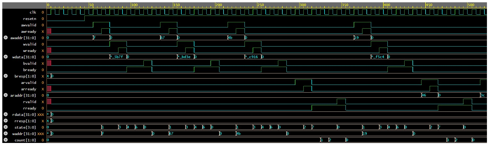

# AXI4-Lite Slave Verification using SystemVerilog

A complete SystemVerilog verification environment for an AXI4-Lite Slave featuring constrained-random stimulus generation, mailbox-based communication, self-checking scoreboard, protocol verification using SystemVerilog Assertions (SVA), and waveform analysis.

---

## 📌 Project Overview

This project verifies the functionality and protocol compliance of an AXI4-Lite Slave using a custom SystemVerilog testbench.

The verification environment includes:

- Constrained-random transaction generation
- Mailbox-based communication
- Driver, Monitor, Generator, Environment
- Self-checking Scoreboard
- SystemVerilog Assertions (SVA)
- Functional verification
- Protocol compliance checking
- Waveform analysis

---

# Repository Structure

```text
AXI4-Lite-Verification/
│
├── rtl/
│   ├── axi_lite_slave.sv
│   └── axi_if.sv
│
├── verification/
│   ├── transaction.sv
│   ├── generator.sv
│   ├── driver.sv
│   ├── monitor.sv
│   ├── scoreboard.sv
│   ├── environment.sv
│   ├── axi_assertions.sv
│   └── testbench.sv
│
├── axi_waveform.jpg
│
└── README.md
```

---

# Verification Environment

The custom verification environment consists of the following components:

### Generator
- Generates constrained-random read and write transactions.
- Sends transactions to the driver using a mailbox.

### Driver
- Drives AXI4-Lite interface signals.
- Performs write and read handshakes.
- Communicates with the DUT.

### Monitor
- Observes DUT interface activity.
- Captures completed transactions.
- Sends transaction information to the scoreboard.

### Scoreboard
- Stores expected memory contents.
- Compares DUT output with expected data.
- Reports PASS/FAIL results automatically.

### Environment
- Connects all verification components.
- Controls overall simulation flow.

---

# SystemVerilog Assertions (SVA)

The following protocol assertions are implemented:

- Reset verification
- Write address handshake
- Write data handshake
- Write response timing
- BRESP validity
- Read address handshake
- Read response timing
- RRESP validity
- RVALID hold until handshake
- BVALID hold until handshake
- Stable AWADDR during wait state
- Stable WDATA during wait state
- Stable ARADDR during wait state
- Valid write address range
- Valid read address range

---

# AXI4-Lite Channels Verified

### Write Address Channel

- AWVALID
- AWREADY
- AWADDR

### Write Data Channel

- WVALID
- WREADY
- WDATA

### Write Response Channel

- BVALID
- BREADY
- BRESP

### Read Address Channel

- ARVALID
- ARREADY
- ARADDR

### Read Data Channel

- RVALID
- RREADY
- RDATA
- RRESP

---

# Verification Flow

```text
Generator
      │
      ▼
Driver
      │
      ▼
AXI4-Lite Slave DUT
      │
      ▼
Monitor
      │
      ▼
Scoreboard
```

---

# Simulation Waveform

The waveform below demonstrates a complete AXI4-Lite transaction flow, including reset, write transaction, read transaction, protocol handshakes, response generation, and internal DUT state transitions.

<p align="center">

</p>

The waveform illustrates:

- Reset sequence
- Write address handshake (AWVALID/AWREADY)
- Write data handshake (WVALID/WREADY)
- Write response (BVALID/BREADY)
- Read address handshake (ARVALID/ARREADY)
- Read data response (RVALID/RREADY)
- FSM state transitions
- Internal write address register updates
- Transaction counter activity

---

# Sample Simulation Log

```text
[DRV] RESET DONE

[GEN] Generated Write Transaction

[DRV] Driving Write Address

[MON] Captured Write Transaction

[SCO] DATA STORED

[GEN] Generated Read Transaction

[DRV] Driving Read Address

[MON] Captured Read Transaction

[SCO] DATA MATCHED
```

---

# Features

- Custom SystemVerilog Verification Environment
- Mailbox-Based Communication
- Constrained-Random Verification
- Self-Checking Scoreboard
- SystemVerilog Assertions (SVA)
- AXI4-Lite Protocol Verification
- Functional Verification
- Waveform Analysis
- Modular Testbench Architecture

---

# Tools Used

- SystemVerilog
- QuestaSim / ModelSim
- EPWave
- Git
- GitHub

---

# Future Improvements

- Functional Coverage
- Coverage-Driven Verification
- UVM-Based Testbench
- Automated Regression Testing
- Error Injection Testcases
- AXI4 Full Burst Transaction Support

---

# Author

**Shreya Sharma**

Electronics & Communication Engineering

**Skills:** RTL Design • SystemVerilog • Design Verification • AXI4-Lite • SystemVerilog Assertions (SVA) • Digital Design • FPGA • VLSI

---

⭐ If you found this project useful, consider giving it a star!
